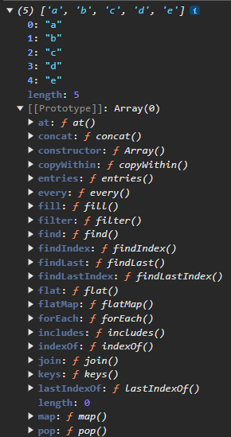

# Prototypes

Prototypes sind ähnlich zu Klassen im klassischen OOP. Dabei enthält ein Prototype Methoden und ein Objekt kann auf diese Methoden zugreifen.

* Objekte sind verknüpft mit dem Prototype-Objekt
* **Prototypal Inheritance**: Der Prototype beinhaltet alle Methoden, welche für alle verknüpften Objekte zugänglich sind.
* Verhalten wird zum verknüpften Prototype Objekt delegiert.

## Beispiel

Wenn wir die `map`-Funktion auf einem Array nutzen, dann nutzen wir eigentlich die Methode vom `Array`-Prototype.&#x20;

<figure><figcaption>
<code>Array</code>-Prototype
</figcaption></figure>

## Prototypal Inheritance

<figure><figcaption>
Prototypal Inheritance
</figcaption></figure>

## Prototype Chain

<figure><figcaption>
Prototype Chain
</figcaption></figure>
