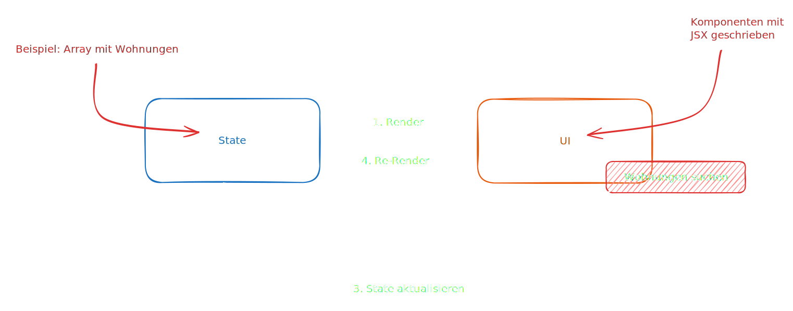

# Was ist React?

React

_Extremely popular **declarative**, **component-based**, **state-driven** JavaScript **library** for building user interfaces, created by Meta._

React eignet sich also besonders für die folgenden zwei Punkte:

1. **Komponenten** basierend auf ihrem aktuellen State auf einer Webpage rendern
2. Die **UI synchron mit dem State halten**, indem es die Seite re-rendert, wenn der State sich ändert

## Component-Based

React ist ein Framework, welches auf Komponenten basiert.

* Komponenten sind die **Baublöcke** unseres User Interfaces in React
* Wir bauen komplexe UIs, indem wir mehrere Komponenten bauen und diese dann miteinander wie Legosteine kombinieren

Komponenten können dabei ganz unterschiedlich sein, bspw. können sie so gross wie eine **Sidebar** sein oder so klein wie ein **Button**.


Komponenten können wir überall auf unserer UI widerverwenden


## Deklarativ

Deklarativ

Wir sagen React, wie eine Komponente aussehen soll basierend auf den aktuellen Daten und dem aktuellen Status.

Wir **beschreiben**, wie Komponenten aussehen und wie sie funktioniert mit einer deklarativen Syntax namens **JSX**.

JSX

Eine Syntax, die HTML, CSS, JavaScript kombiniert und **andere Komponenten** referenzieren kann.

React bietet uns eine **Abstraktion** von unserem DOM -> **wir arbeiten niemals mit dem DOM**!

## State-Driven


React **reagiert** auf State-Changes, indem es die UI neu rendert.


## Library

React wird oftmals als Framework betitelt, obwohl es das gar nicht ist.


React ist eine **Library**! React deckt nur den sogenannten **View**-Teil unserer Applikation ab.


Jedoch gibt es einige Frameworks, die auf React aufbauen, bspw. **Next.js** und **Remix**. Diese fügen z.B. noch Routing und SSR hinzu.

